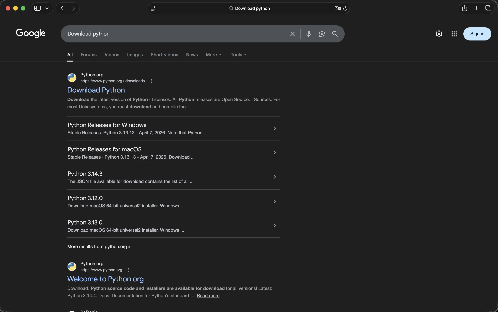
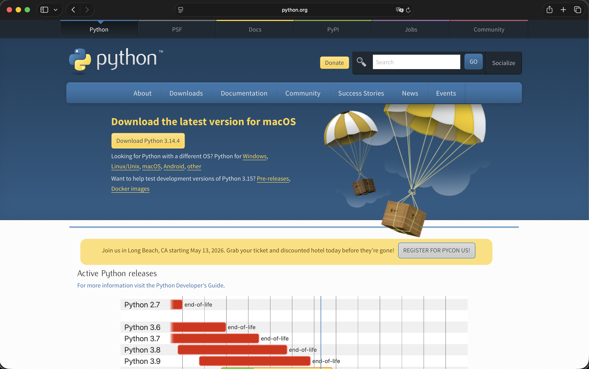
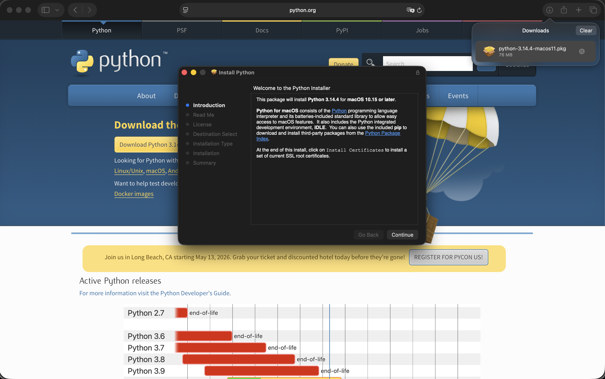
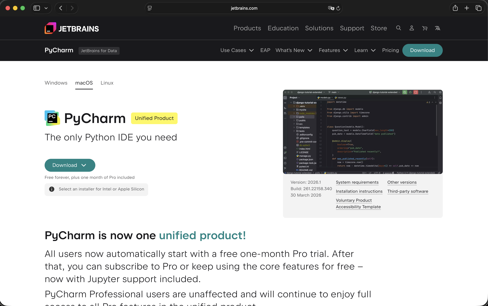
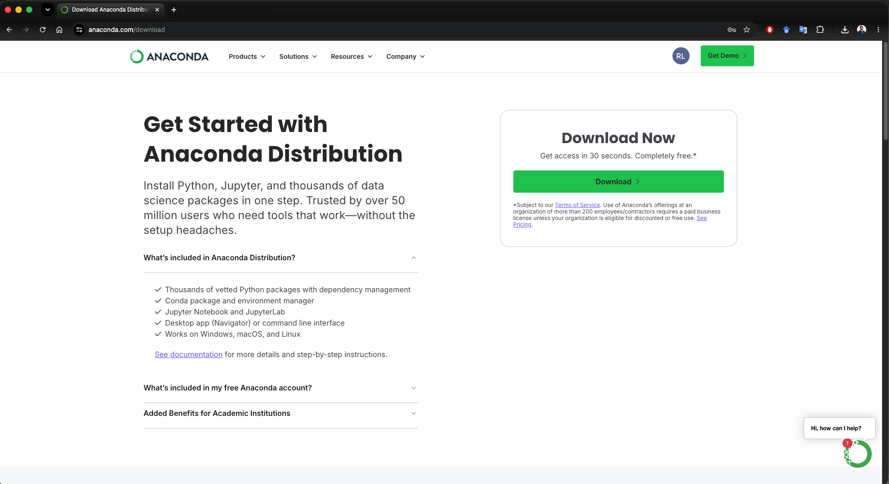

```{python}
#| label: setup
#| include: false

import warnings
warnings.filterwarnings("ignore")
```

# Punto de partida

## Cómo se trabajará con Python en el curso

- El curso usará dos espacios complementarios. Las presentaciones organizarán la explicación conceptual, mientras que [Google Colab](https://colab.research.google.com/) permitirá ejecutar código más largo, compartir *notebooks* y trabajar con datos sin depender de una instalación local.

. . .

- Esta decisión tiene una razón práctica. En una clase con estudiantes que usan distintas computadoras, sistemas operativos y configuraciones, la instalación local puede convertirse en una barrera innecesaria para comenzar.

. . .

- Google Colab funcionará como el entorno común: todos podrán abrir el mismo notebook, ejecutar las mismas celdas y modificar el código sin instalar Python en su computadora.

. . .

- La instalación local seguirá siendo útil. [Anaconda](https://www.anaconda.com/), [JupyterLab](https://jupyter.org/), [Spyder](https://www.spyder-ide.org/), [PyCharm](https://www.jetbrains.com/pycharm/) o [Python](https://www.python.org/) oficial permiten trabajar de forma más autónoma, pero se tratarán como opciones complementarias y no como requisito inicial.

## Diferencia entre lenguaje, intérprete, paquetes y entorno

- **Lenguaje:** Python define una sintaxis para expresar instrucciones computacionales. Por ejemplo, `print("Hola")` es una instrucción válida porque sigue las reglas del lenguaje.

. . .

- **Intérprete:** es el programa que lee y ejecuta esas instrucciones. Sin intérprete, el código escrito en un archivo o notebook es solo texto.

. . .

- **Paquetes:** son bibliotecas que agregan funcionalidad. En análisis de datos se usarán con frecuencia `numpy`, `pandas`, `matplotlib` y `scipy`.

. . .

- **Entorno:** es la combinación concreta de una versión de Python y un conjunto de paquetes instalados. Muchos errores aparecen porque el código se ejecuta en un entorno distinto del que se cree estar usando.

# Python, notebooks y ejecución

## Python no es una sola herramienta

- En el lenguaje cotidiano se dice “usar Python”, pero esa expresión puede referirse a varias piezas distintas del ecosistema.

. . .

- Python puede escribirse en un archivo `.py`, en una celda de Google Colab, en JupyterLab, en Spyder, en PyCharm, en VS Code o incluso en una terminal.

. . .

- La herramienta puede cambiar, pero la lógica de base es la misma: se escriben instrucciones, el intérprete las ejecuta y se observan resultados, errores u objetos creados en memoria.

. . .

- Esta separación evita una confusión común: instalar un editor no siempre instala Python, e instalar Python no necesariamente instala un entorno completo de análisis de datos.

## Script y notebook

- Un **script** es un archivo de texto con extensión `.py`. Normalmente se ejecuta de arriba hacia abajo como una secuencia completa de instrucciones.

. . .

- Un **notebook** es un documento con celdas. Cada celda puede contener código, texto, fórmulas, tablas o gráficos, y puede ejecutarse de manera interactiva.

. . .

- Los scripts son apropiados para procesos ordenados, automatización y programas que deben ejecutarse de forma completa y repetible.

. . .

- Los notebooks son especialmente útiles para enseñar y explorar datos porque permiten alternar explicación, código y resultados visibles. Su principal cuidado es mantener el orden de ejecución.

## Computadora local y nube

- Ejecutar Python localmente significa que el código corre en la propia computadora. Esto permite trabajar sin conexión a internet y controlar mejor carpetas, archivos y entornos.

. . .

- Ejecutar Python en la nube significa que el código corre en un servidor externo. Google Colab funciona bajo esta lógica: el navegador muestra el notebook, pero la ejecución ocurre fuera de la computadora local.

. . .

- La nube facilita el inicio porque reduce los problemas de instalación. En cambio, una instalación local exige más configuración, pero ofrece más autonomía.

. . .

- En este curso, Colab será el punto común de ejecución; la instalación local se presentará como una capacidad adicional para quienes quieran trabajar con mayor independencia.

# Herramienta principal: Google Colab

## Google Colab como entorno común del curso

- Este es un curso de estadística y Python será la herramienta para implementar los análisis. Si bien existen varias formas de instalar y ejecutar Python, se usará Google Colab como entorno común para todos los estudiantes.

. . .

- Google Colab permite ejecutar notebooks de Python desde el navegador. Esto hace posible comenzar a programar y analizar datos sin instalar Python, Anaconda ni un editor local.


. . .

- Colab ya incluye muchos paquetes frecuentes de ciencia de datos. Esto reduce la fricción inicial cuando se necesita usar `numpy`, `pandas` o `matplotlib`.

. . .

- La contrapartida es que la sesión vive en la nube. Si la sesión se reinicia, los objetos en memoria desaparecen y será necesario ejecutar nuevamente las celdas desde el inicio.  

## Google Colab: Python en la nube

:::: {.columns}

::: {.column width="62%"}
:::{.incremental}
{width=100%}

- Para ir al sitio: [Google Colab](https://colab.research.google.com/)

- **Qué se observa:** una plataforma de notebooks ejecutada desde el navegador, pensada para escribir texto, código y resultados en un mismo documento.

:::
:::

::: {.column width="38%"}

::: {.incremental}


- **Por qué importa:** elimina la necesidad de configurar Python en cada computadora antes de empezar con los ejercicios del curso.

- **Uso en clase:** se utilizará para análisis más largos, simulaciones, manejo de bases de datos y ejercicios que convenga compartir mediante enlace.

- **Cuidado principal:** se debe guardar una copia propia del notebook y recordar que la sesión puede reiniciarse.

:::
:::
::::

## Ejecutar código en Google Colab

:::: {.columns}

::: {.column width="62%"}
:::{.incremental}

{width=100%}

- **Qué se observa:** un notebook organizado en celdas. Algunas celdas contienen código y otras pueden contener explicación en texto.

:::
:::

::: {.column width="38%"}

::: {.incremental}


- **Cómo se trabaja:** se escribe código en una celda, se ejecuta y el resultado aparece debajo. Esto permite verificar cada paso del análisis.

- **Ventaja para aprender:** una idea estadística puede explicarse, implementarse y modificarse en vivo sin cambiar de herramienta.

- **Regla de trabajo:** las celdas deben ejecutarse en orden. Si se ejecutan de forma desordenada, el notebook puede dar resultados inconsistentes.

:::
:::
::::

## Flujo básico de trabajo en Colab

- Primero se abre el enlace compartido por el profesor. Ese enlace puede llevar a un notebook de ejemplo, una práctica guiada o un ejercicio con datos.

. . .

- Luego se crea una copia personal, normalmente mediante `File > Save a copy in Drive`. Esa copia queda asociada a la cuenta de Google del estudiante.

. . .

- Después se ejecutan las celdas de arriba hacia abajo. Este orden permite reconstruir el análisis desde el inicio y evita depender de objetos creados accidentalmente.

. . .

- Finalmente, las modificaciones deben hacerse en la copia personal. De esa forma, cada estudiante conserva sus respuestas, cambios y pruebas sin alterar el archivo original.

## Guardar una copia: por qué es importante

- Un notebook compartido suele ser una plantilla. Si varias personas intentan trabajar sobre el mismo archivo original, se pierde el control sobre los cambios.

. . .

- Guardar una copia crea una versión individual del documento. Esa versión puede modificarse, romperse, corregirse y volver a ejecutarse sin afectar al resto del grupo.

. . .

- Esta práctica también facilita la revisión posterior: el estudiante conserva el código exacto que ejecutó y puede volver sobre sus errores o resultados.

. . .

- En análisis de datos, guardar el procedimiento es tan importante como guardar el resultado. El objetivo no es solo obtener una tabla o gráfico, sino saber cómo se obtuvo.

## Manejo de datos en Colab

- En Colab, los archivos de la computadora no están disponibles automáticamente. El notebook se ejecuta en una sesión remota, no directamente sobre las carpetas locales.

. . .

- Para usar datos existen varias rutas: subir un archivo manualmente, conectar Google Drive, descargar datos desde una URL o leerlos desde una fuente pública.

. . .

- En las primeras prácticas conviene usar notebooks preparados con instrucciones explícitas de carga de datos. Así se reduce la posibilidad de errores por rutas o nombres de archivo.

. . .

- Cuando se use el dataset del curso, se indicará si el archivo debe subirse a Colab, leerse desde una URL o mantenerse en una carpeta específica de Google Drive.

## Sesiones, memoria y reinicio

- Colab asigna una sesión temporal para ejecutar el notebook. Durante esa sesión se crean objetos en memoria: tablas, variables, gráficos y resultados intermedios.

. . .

- Si la sesión se desconecta o reinicia, esos objetos desaparecen. El notebook sigue existiendo, pero la memoria de ejecución vuelve a estar vacía.

. . .

- Por esta razón, un notebook bien construido debe poder ejecutarse desde el inicio. Cada objeto necesario debe crearse mediante código visible, no depender de una acción manual previa.

. . .

- Esta regla es una primera aproximación a la reproducibilidad: un análisis es más confiable cuando puede reconstruirse ejecutando el documento completo.

## Prueba mínima de ejecución

```{python}
print("Python funciona en este entorno")
```

- Esta instrucción confirma que el entorno puede ejecutar código Python básico.

. . .

- En Colab, el resultado aparece debajo de la celda; en un script local, aparecería en la consola.

. . .

- La prueba no verifica todavía paquetes, datos ni gráficos. Solo confirma que la sesión responde correctamente.

. . .

- Antes de iniciar una práctica larga, una prueba simple de ejecución ayuda a separar problemas de entorno de problemas del análisis.

## Verificar versión e intérprete

```{python}
import sys

print(sys.version)
print(sys.executable)
```

- `sys.version` muestra la versión de Python que está ejecutando el notebook.

. . .

- `sys.executable` muestra la ubicación del intérprete. En Colab aparecerá una ruta del entorno remoto; en una instalación local aparecerá una ruta dentro de la computadora.

. . .

- Esta información es útil cuando un código funciona en una herramienta y falla en otra. Muchas veces el problema no es el código, sino el intérprete que lo ejecuta.

. . .

- En una consulta técnica, mostrar esta salida permite diagnosticar con mayor precisión qué entorno está activo.

## Verificar paquetes básicos

```{python}
import numpy as np
import pandas as pd
import matplotlib

print("numpy:", np.__version__)
print("pandas:", pd.__version__)
print("matplotlib:", matplotlib.__version__)
```

- Esta celda comprueba que los paquetes básicos de análisis de datos están disponibles en el entorno.

. . .

- `numpy` se usará para cálculo numérico; `pandas`, para trabajar con tablas; `matplotlib`, para construir gráficos.

. . .

- En Colab, estos paquetes suelen estar disponibles desde el inicio. En una instalación local, pueden faltar si no se instalaron en el entorno activo.

. . .

- Si aparece `ModuleNotFoundError`, el diagnóstico correcto es que el paquete no está disponible en ese entorno, no que Python “no sirva”.

# Instalación local: visión general

## Por qué conviene conocer las opciones locales

- Aunque Colab será la ruta común del curso, una instalación local permite trabajar sin internet, organizar proyectos en carpetas propias y usar editores profesionales.

. . .

- En un entorno laboral o de investigación, no siempre se trabaja en Colab. Muchas instituciones usan servidores internos, computadoras locales, repositorios privados o entornos controlados.

. . .

- Por eso conviene entender las rutas principales: Python oficial, PyCharm, Anaconda, Spyder y JupyterLab. Cada una resuelve un problema distinto.

. . .

- La instalación local no se presenta como requisito inmediato, sino como una competencia técnica que amplía la autonomía del estudiante.

## Python como lenguaje

:::: {.columns}

::: {.column width="56%"}

{width=100%}

Para ir al sitio: [Python](https://www.python.org/)

:::

::: {.column width="44%"}

::: {.incremental}

- **Qué se observa:** el lenguaje Python como núcleo del ecosistema. Las herramientas pueden cambiar, pero el lenguaje que se ejecuta es el mismo.

- **Función principal:** permitir escribir instrucciones para cálculos, manejo de datos, automatización, visualización y modelos estadísticos.

- **Distinción importante:** Python no es lo mismo que Colab, PyCharm o Anaconda. Esas herramientas son formas de escribir o ejecutar Python.

- **En este curso:** Python será el lenguaje de trabajo; Colab será la vía compartida para ejecutar notebooks.

:::
:::
::::

## Descargar Python desde la página oficial

:::: {.columns}

::: {.column width="60%"}

{width=100%}

Para ir al sitio: [Descargas de Python](https://www.python.org/downloads/)

:::

::: {.column width="40%"}

::: {.incremental}

- **Qué se observa:** la página oficial de descargas de Python, desde donde puede instalarse el intérprete en la computadora.

- **Cuándo conviene:** cuando se busca una instalación ligera y se prefiere controlar manualmente qué paquetes se instalan.

- **Qué se obtiene:** principalmente el intérprete de Python y herramientas básicas para instalar paquetes, como `pip`.

- **Cuidado técnico:** después de instalar, se debe verificar que el editor o terminal esté usando esa versión y no otra instalación previa.

:::
:::
::::

## Ejecutar el instalador de Python

:::: {.columns}

::: {.column width="62%"}

{width=100%}

:::

::: {.column width="38%"}

::: {.incremental}

- **Qué se observa:** el asistente de instalación de Python en la computadora.

- **Qué instala:** el intérprete, documentación y componentes auxiliares necesarios para ejecutar código localmente.

- **Qué no resuelve por sí solo:** una instalación base no garantiza que paquetes como `pandas`, `numpy` o `matplotlib` estén disponibles.

- **Verificación posterior:** se debe abrir una herramienta de ejecución y comprobar versión, intérprete y paquetes básicos.

:::
:::
::::

## Python oficial: ventajas y costos

- La instalación oficial es ligera y transparente. Permite partir de una base limpia y agregar solo las herramientas que se necesitan.

. . .

- También permite entender mejor el ecosistema, porque obliga a distinguir entre el intérprete, los paquetes y el editor usado para ejecutar código.

. . .

- Su costo es operativo: requiere mayor cuidado al instalar paquetes, seleccionar el intérprete correcto y resolver problemas de entorno.

. . .

- Para estudiantes que recién comienzan, esta ruta puede ser menos cómoda que Anaconda; para usuarios que buscan control, puede ser preferible.

# PyCharm como opción local

## PyCharm como IDE

:::: {.columns}

::: {.column width="62%"}

{width=100%}

Para ir al sitio: [PyCharm](https://www.jetbrains.com/pycharm/)

:::

::: {.column width="38%"}

::: {.incremental}

- **Qué se observa:** la página de descarga de PyCharm, un entorno de desarrollo integrado especializado en Python.

- **Función principal:** organizar proyectos, escribir scripts, ejecutar archivos y mostrar errores de forma más estructurada que una terminal simple.

- **Cuándo conviene:** cuando se quiere trabajar con archivos `.py`, proyectos con varias carpetas o programación más sistemática.

- **Punto crítico:** PyCharm necesita un intérprete configurado. El editor no reemplaza a Python; lo utiliza.

:::
:::
::::

## 5. Elegir el instalador correcto de PyCharm

:::: {.columns}

::: {.column width="62%"}

{width=100%}

:::

::: {.column width="38%"}

::: {.incremental}

- **Qué se observa:** opciones de descarga según sistema operativo y arquitectura de la computadora.

- **Qué se debe revisar:** si se usa Windows, macOS o Linux; en macOS, si la computadora usa procesador Intel o Apple Silicon.

- **Por qué importa:** instalar una versión incompatible puede causar problemas de ejecución, rendimiento o apertura del programa.

- **Relación con Python:** después de instalar PyCharm, se debe seleccionar o crear un entorno de Python para cada proyecto.

:::
:::
::::

## 6. Pantalla inicial de PyCharm

:::: {.columns}

::: {.column width="62%"}

{width=100%}

:::

::: {.column width="38%"}

::: {.incremental}

- **Qué se observa:** opciones para crear scripts, notebooks, abrir archivos o explorar herramientas del IDE.

- **Primer uso recomendado:** crear un script simple para comprobar que PyCharm ejecuta código con el intérprete correcto.

- **Diferencia con Colab:** PyCharm trabaja principalmente con archivos locales; Colab trabaja con notebooks en la nube.

- **Valor pedagógico:** ayuda a entender el flujo archivo → ejecución → consola, que es central en programación estructurada.

:::
:::
::::

## 7. Ejecutar un script en PyCharm

:::: {.columns}

::: {.column width="62%"}

{width=100%}

:::

::: {.column width="38%"}

::: {.incremental}

- **Qué se observa:** un archivo `script.py`, la estructura del proyecto y una consola donde aparece la salida del programa.

- **Qué enseña:** el código se guarda en un archivo, se ejecuta con un intérprete y produce resultados o errores en la consola.

- **Diagnóstico básico:** si un paquete no aparece disponible, se debe revisar el intérprete del proyecto antes de reinstalar herramientas.

- **Uso en el curso:** PyCharm puede servir para quienes quieran practicar scripts, aunque los análisis compartidos se realizarán en Colab.

:::
:::
::::

## Prueba mínima en script local

```{python}
print("Hello World")
```

- Esta prueba confirma que un script local puede ejecutarse correctamente.

. . .

- No requiere paquetes externos ni datos. Por eso es una buena prueba inicial para aislar problemas de configuración.

. . .

- Si funciona, el flujo básico editor-intérprete-consola está operativo.

. . .

- Si falla, se debe revisar la configuración del proyecto, el intérprete seleccionado o la instalación de Python.

# Anaconda como opción local integrada

## 8. Descargar Anaconda

:::: {.columns}

::: {.column width="62%"}

{width=100%}

Para ir al sitio: [Anaconda](https://www.anaconda.com/download)

:::

::: {.column width="38%"}

::: {.incremental}

- **Qué se observa:** la página de descarga de Anaconda Distribution, una distribución orientada a ciencia de datos.

- **Qué resuelve:** instala Python junto con un conjunto amplio de paquetes y aplicaciones frecuentes para análisis de datos.

- **Por qué es cómoda:** reduce la necesidad de instalar manualmente herramientas como JupyterLab, Notebook o Spyder.

- **Costo principal:** ocupa más espacio y agrega más componentes que una instalación mínima de Python.

:::
:::
::::

## 9. Anaconda versus Miniconda

:::: {.columns}

::: {.column width="62%"}

{width=100%}

Para ir al sitio: [Miniconda](https://docs.conda.io/en/latest/miniconda.html)

:::

::: {.column width="38%"}

::: {.incremental}

- **Anaconda Distribution:** instala una caja de herramientas amplia para ciencia de datos desde el inicio.

- **Miniconda:** instala una base pequeña con Python y `conda`, dejando que el usuario agregue solo lo necesario.

- **Para principiantes:** Anaconda suele reducir fricción porque muchas aplicaciones ya están disponibles.

- **Para usuarios avanzados:** Miniconda ofrece más control y evita instalar componentes innecesarios.

:::
:::
::::

## Cuándo conviene Anaconda

- Anaconda conviene cuando se quiere trabajar localmente con una configuración relativamente completa desde el inicio.

. . .

- Es especialmente útil si se desea abrir JupyterLab o Spyder desde una interfaz gráfica, sin depender de comandos de terminal.

. . .

- También puede funcionar como respaldo cuando no hay internet o cuando Colab presenta restricciones temporales.

. . .

- Su principal advertencia es que la comodidad inicial no elimina la necesidad de entender qué entorno está activo y dónde se instalan los paquetes.

## 10. Anaconda Navigator

:::: {.columns}

::: {.column width="62%"}

{width=100%}

:::

::: {.column width="38%"}

::: {.incremental}

- **Qué se observa:** Anaconda Navigator, una interfaz gráfica para abrir aplicaciones y gestionar entornos.

- **Función práctica:** permite lanzar JupyterLab, Notebook, Spyder y otras herramientas sin escribir comandos.

- **Por qué ayuda:** centraliza varias herramientas de ciencia de datos en un panel de control visual.

- **Cuidado técnico:** aunque Navigator simplifica el acceso, se debe revisar qué entorno está usando cada aplicación.

:::
:::
::::

# Spyder y JupyterLab

## 11. Spyder desde Anaconda

:::: {.columns}

::: {.column width="62%"}

{width=100%}

Para ir al sitio: [Spyder](https://www.spyder-ide.org/)

:::

::: {.column width="38%"}

::: {.incremental}

- **Qué se observa:** Spyder abierto desde el ecosistema de Anaconda.

- **Qué es:** un IDE científico que combina editor, consola, explorador de variables y paneles auxiliares.

- **Cuándo conviene:** cuando se desea trabajar con scripts y observar de forma visual los objetos creados en memoria.

- **Advertencia metodológica:** el análisis no debe depender del estado actual de la sesión; el script debe poder ejecutarse desde cero.

:::
:::
::::

## 12. Spyder: editor, consola y variables

:::: {.columns}

::: {.column width="62%"}

{width=100%}

:::

::: {.column width="38%"}

::: {.incremental}

- **Qué se observa:** un entorno dividido entre script, consola y explorador de variables.

- **Valor didáctico:** permite visualizar que el código crea objetos en memoria, como números, listas, tablas o resultados intermedios.

- **Uso razonable:** ejecutar bloques de código, verificar resultados y explorar objetos durante el aprendizaje.

- **Riesgo habitual:** modificar objetos manualmente o ejecutar fragmentos aislados puede dificultar la reproducción completa del análisis.

:::
:::
::::

## 13. JupyterLab desde Anaconda

:::: {.columns}

::: {.column width="62%"}

{width=100%}

Para ir al sitio: [JupyterLab](https://jupyter.org/)

:::

::: {.column width="38%"}

::: {.incremental}

- **Qué se observa:** JupyterLab, un entorno local para trabajar con notebooks, archivos, terminales y resultados.

- **Relación con Colab:** ambos usan la lógica de celdas, combinando código, texto y salida en un mismo documento.

- **Diferencia esencial:** JupyterLab corre en la computadora local; Colab corre en la nube.

- **Uso recomendado:** resulta útil cuando se quiere trabajar con notebooks sin depender de conexión permanente a internet.

:::
:::
::::

## 14. JupyterLab: trabajar por celdas

:::: {.columns}

::: {.column width="62%"}

{width=100%}

:::

::: {.column width="38%"}

::: {.incremental}

- **Qué se observa:** un notebook con celdas de código y resultados visibles debajo.

- **Ventaja principal:** permite construir análisis paso a paso, alternando explicación, cálculo y visualización.

- **Cuidado central:** las celdas pueden ejecutarse fuera de orden, generando resultados que no se reconstruyen desde el inicio.

- **Regla práctica:** reiniciar el kernel y ejecutar todo desde arriba es la prueba mínima de reproducibilidad.

:::
:::
::::

# Comparación de herramientas de trabajo

## Herramientas disponibles y función principal


| Herramienta | Uso recomendado |
|:-|-----|
| Google Colab | Trabajar en la nube, ejecutar notebooks sin instalación local y compartir ejercicios con facilidad. |
| Anaconda | Instalar un entorno completo de ciencia de datos con Python, paquetes comunes y aplicaciones como JupyterLab y Spyder. |
| JupyterLab local | Trabajar con notebooks en la computadora, organizando código, resultados y texto en celdas. |
| Spyder | Escribir scripts científicos con editor, consola y explorador de variables en una misma interfaz. |
| PyCharm | Desarrollar proyectos de Python más estructurados, con carpetas, scripts, entornos e intérpretes bien definidos. |
| Python oficial | Instalar una versión ligera de Python y gestionar paquetes de forma más directa con `pip` y entornos virtuales. |

## Recomendación operativa del curso

- Para las prácticas y análisis compartidos, se usará Google Colab. Esto asegura que todos puedan ejecutar el mismo notebook con una configuración similar.

. . .

- Para trabajar localmente con menor fricción, Anaconda es una opción razonable porque instala varias herramientas de ciencia de datos en un solo ecosistema.

. . .

- Para quienes quieran aprender programación con estructura de proyecto, PyCharm o VS Code pueden ser herramientas útiles, siempre que el intérprete esté bien configurado.

. . .

- La ruta elegida no debe distraer del objetivo central: construir análisis estadísticos claros, reproducibles y conceptualmente bien interpretados.

# Mejores prácticas: ejecución, guardado y diagnóstico

## Ejecutar notebooks en orden

- En un notebook, el orden de ejecución importa. Una celda puede depender de objetos creados en celdas anteriores.

. . .

- Ejecutar celdas de forma desordenada puede hacer que el resultado dependa de memoria oculta, no del documento visible.

. . .

- La práctica correcta es ejecutar desde arriba hacia abajo, especialmente antes de entregar, compartir o revisar un análisis.

. . .

- Esta regla aplica tanto a Google Colab como a JupyterLab local.

## Guardar el trabajo de forma reproducible

- En Colab se debe guardar una copia propia del notebook antes de modificarlo. Esa copia conserva cambios, respuestas y experimentos personales.

. . .

- En una instalación local, se debe guardar el archivo `.py` o `.ipynb` en una carpeta de proyecto clara.

. . .

- Cuando se trabaja con datos, también se debe conservar la ruta de carga y las transformaciones realizadas.

. . .

- La reproducibilidad comienza cuando otra persona —o el propio estudiante semanas después— puede reconstruir el resultado siguiendo el código.

## Información mínima para pedir ayuda

- Cuando aparece un error, conviene copiar el mensaje completo. La última línea suele indicar el tipo de error y las líneas anteriores muestran dónde ocurrió.

. . .

- También se debe indicar la herramienta utilizada: Colab, JupyterLab, Spyder, PyCharm, VS Code o Quarto.

. . .

- En instalación local, es especialmente importante mostrar la versión de Python y la ruta del intérprete.

. . .

- Un diagnóstico serio requiere contexto: código ejecutado, error completo, herramienta usada y entorno activo.

## Celda de diagnóstico

```{python}
import sys

print("Versión de Python:")
print(sys.version)

print("\nIntérprete activo:")
print(sys.executable)
```

- Esta celda muestra qué Python está ejecutando el código.

. . .

- En Colab, la ruta corresponde a un entorno remoto. En una computadora local, la ruta corresponde a una instalación dentro del sistema.

. . .

- Si dos herramientas muestran rutas distintas, probablemente están usando entornos distintos.

. . .

- Esta información permite resolver muchos problemas antes de cambiar código o reinstalar paquetes.

## Celda de verificación de paquetes

```{python}
import numpy as np
import pandas as pd
import matplotlib

print("numpy:", np.__version__)
print("pandas:", pd.__version__)
print("matplotlib:", matplotlib.__version__)
```

- Esta celda verifica que los paquetes mínimos del curso están disponibles.

. . .

- También muestra sus versiones, lo cual puede ser útil si una función se comporta distinto entre computadoras.

. . .

- En Colab, normalmente funcionará sin configuración adicional.

. . .

- En una instalación local, un error en esta celda suele indicar que el paquete falta en el entorno activo.

# Problemas frecuentes

## `ModuleNotFoundError`

- Este error significa que Python no encuentra un paquete solicitado.

. . .

- Un ejemplo típico es `ModuleNotFoundError: No module named 'pandas'`. La interpretación correcta es que `pandas` no está instalado en el entorno que ejecuta el código.

. . .

- En Colab, algunos paquetes pueden instalarse durante la sesión. En local, deben instalarse en el entorno correcto.

. . .

- Reinstalar paquetes sin revisar el intérprete puede empeorar la confusión. Primero se debe identificar qué entorno está activo.

## La sesión de Colab se reinició

- Cuando Colab reinicia la sesión, desaparecen los objetos creados en memoria, aunque el notebook siga guardado.

. . .

- La solución práctica es volver a ejecutar las celdas desde el inicio.

. . .

- Si el notebook está bien organizado, ese reinicio no debería destruir el análisis: solo exige reconstruirlo.

. . .

- Esta situación muestra por qué el código debe contener todos los pasos relevantes y no depender de acciones manuales invisibles.

## No aparecen los datos

- En Colab, los archivos de la computadora no están disponibles automáticamente porque el código se ejecuta en una sesión remota.

. . .

- Para usar datos puede ser necesario subir un archivo, conectar Google Drive o descargar datos desde una fuente externa.

. . .

- En instalación local, el problema suele estar en la carpeta de trabajo o en una ruta mal escrita.

. . .

- En ambos casos, el principio es el mismo: el código debe indicar claramente dónde están los datos y cómo se cargan.

## Varias instalaciones de Python

- Una misma computadora puede tener Python oficial, Anaconda, entornos virtuales y editores que usan intérpretes distintos.

. . .

- Esta situación no es necesariamente un problema, pero exige saber qué Python está ejecutando cada herramienta.

. . .

- La celda con `sys.executable` permite observar la ruta del intérprete activo.

. . .

- Para estudiantes que recién comienzan, Colab reduce inicialmente esta complejidad porque todos trabajan sobre un entorno remoto similar.

# Conclusiones

## Ideas centrales de la clase

- El curso utilizará Google Colab como espacio común para ejecutar notebooks y compartir código.

. . .

- Python es el lenguaje; Colab, JupyterLab, Spyder y PyCharm son formas distintas de trabajar con ese lenguaje.

. . .

- La instalación local es útil para ganar autonomía, pero el inicio del curso no dependerá de que todas las computadoras estén configuradas de la misma forma.

. . .

- Una buena práctica desde el primer día es verificar versión, intérprete, paquetes y orden de ejecución antes de asumir que el problema está en el código.

## Preparación antes de la próxima clase

- Abrir Google Colab con una cuenta personal o institucional.

. . .

- Crear o abrir un notebook y ejecutar una celda con `print("Python funciona en este entorno")`.

. . .

- Ejecutar la celda de diagnóstico con `sys.version` y `sys.executable`.

. . .

- Ejecutar la celda de verificación de paquetes con `numpy`, `pandas` y `matplotlib`.

## Próximo paso

- La siguiente clase introducirá los primeros elementos de programación en Python: objetos, asignación, tipos básicos y operaciones simples.

. . .

- El código seguirá siendo pequeño, pero ya comenzará a formar una base computacional para el análisis estadístico.

. . .

- Posteriormente, se pasará a datos tabulares, visualización y medidas descriptivas, siempre conectando el concepto estadístico con su implementación en Python.

. . .

- El objetivo de fondo será que cada cálculo pueda explicarse, ejecutarse y reproducirse con claridad.

:::{.callout-note title="Idea final"}
El punto de partida no es instalar la mayor cantidad de herramientas, sino construir un flujo de trabajo que permita explicar, ejecutar, revisar y compartir análisis de manera ordenada.
:::